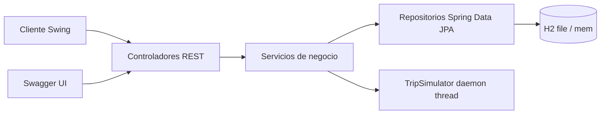
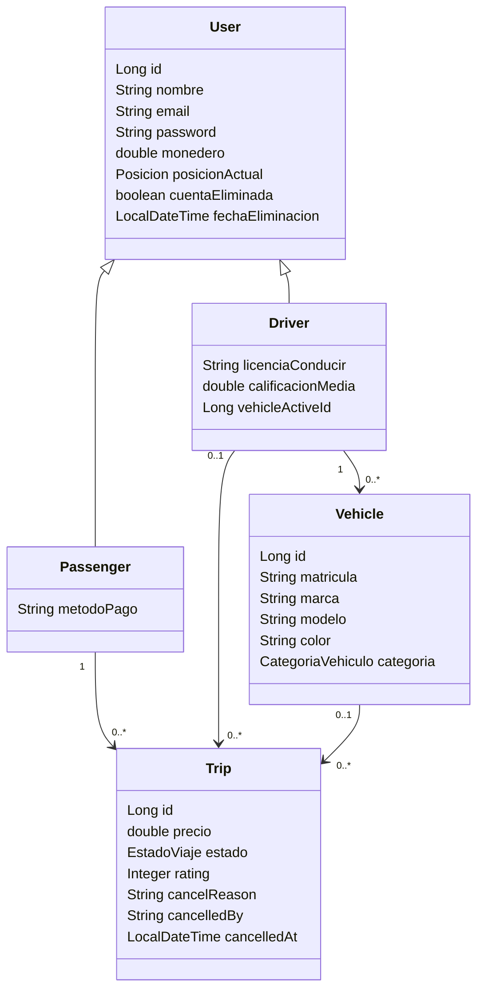
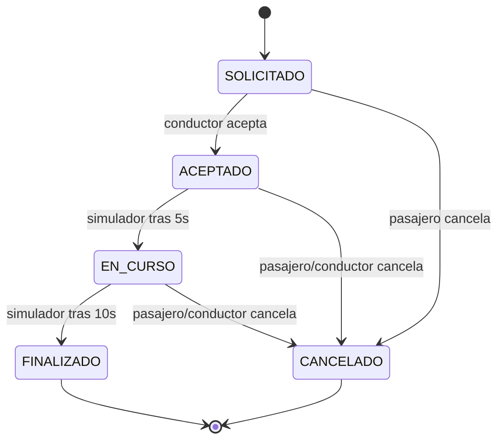

# Arquitectura

## Vista general

## Capas

### Presentación

- `swing/`: cliente pesado Java Swing.
- `controller/`: API REST usada por Swing, Swagger y tests MockMvc.

### Servicios

- `TripService`: solicitud, aceptación, simulación, cancelación y finalización de viajes.
- `PassengerService`: registro, login, historial, valoración, wallet y borrado lógico.
- `DriverService`: registro, login, historial, wallet, ganancias y borrado lógico.
- `VehicleService`: alta de vehículos y cambio de vehículo activo.

### Persistencia

- `PassengerRepository`
- `DriverRepository`
- `TripRepository`
- `VehicleRepository`
- `LoggedUserRepository`

## Modelo de dominio

## Estados de viaje

## Decisiones importantes

- El borrado de cuenta es lógico, no físico. Motivo: los viajes históricos mantienen trazabilidad y no se rompen claves foráneas.
- En Docker se arranca sin Swing. Motivo: los contenedores estándar son headless.
- El hilo de simulación se marca como daemon. Motivo: no bloquea la JVM ni los tests si todavía está durmiendo.
- El enum de estado/categoría se persiste como `STRING`. Motivo: evita que cambiar el orden del enum corrompa datos.
